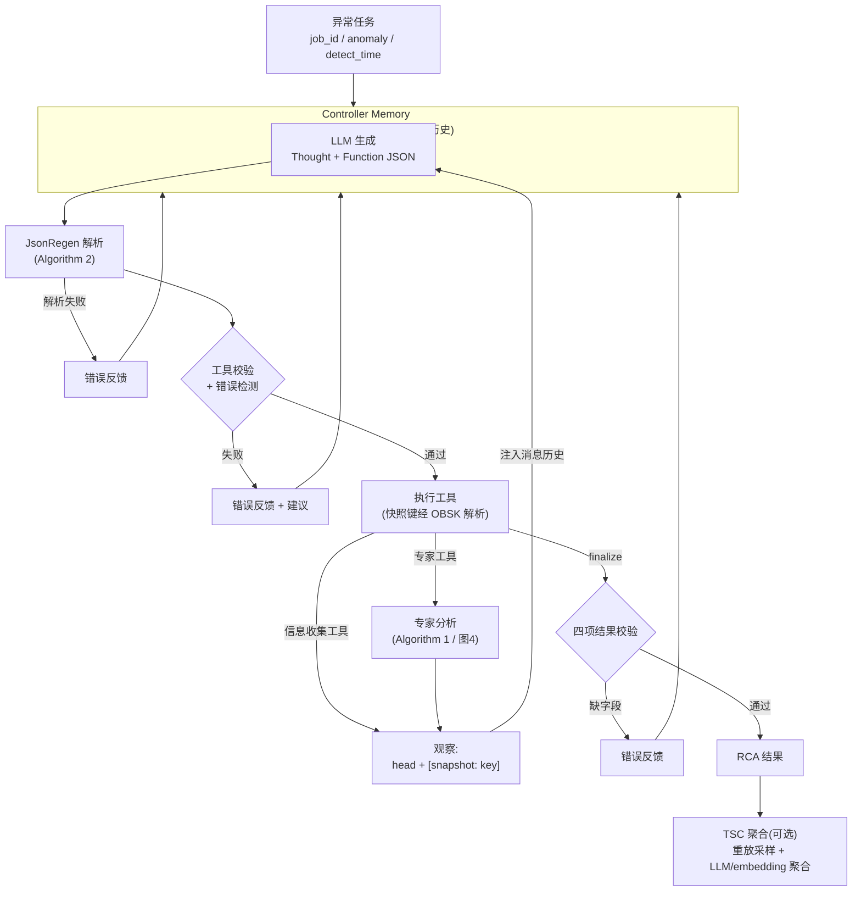

# RCAgent 复现项目

论文 [RCAgent: Cloud Root Cause Analysis by Autonomous Agents with Tool-Augmented
Large Language Models](https://arxiv.org/abs/2310.16340)(arXiv:2310.16340)的复现实现。

详细需求见 [PRD_RCAgent_复现开发文档.md](PRD_RCAgent_复现开发文档.md)。

## 系统架构:决策循环



四个回路:观察推进调查(正常)、解析失败重试(JsonRegen)、动作修正(错误处理)、
finalize 出口——所有反馈都回到 Controller Memory,循环不因错误终止。

## 当前进度(M1~M7 框架,已完成)

- [x] Controller Agent thought-action-observation 循环(`rcagent/core/agent.py`)
- [x] Prompt 三件套:框架规则 / 任务要求 / 工具文档(`rcagent/core/prompts.py` + `config/prompts/`)
- [x] 工具注册框架:语义极简参数 + 模糊去重 + finalize 出口(`rcagent/core/tools.py`)
- [x] OBSK 观察快照键:head + snapshot 键值库,快照键作为工具参数传递(`rcagent/core/obs.py`)
- [x] JsonRegen 结构化输出修复:Algorithm 2 全流程(`rcagent/core/jsonregen.py`)
- [x] 错误处理:重复调用 / trivial 输入 / 过早 finalize(`rcagent/core/errors.py`)
- [x] 轨迹记录:JSONL 完整落盘,含每步送入 LLM 的 prompt(`rcagent/core/trajectory.py`)
- [x] LLM 调用层:DeepSeek/OpenAI 兼容 + mock 模式 + 成本计量(`rcagent/llm/`)
- [x] 解码策略:greedy 默认 + 自适应重复惩罚 + SC 采样配置(`rcagent/llm/decode.py`)
- [x] 环境适配层 + 本地合成日志 demo 环境(`rcagent/env/`)
- [x] 日志专家 agent(Algorithm 1):语义分区(Louvain + 连续性去重叠)+ 知识库 ICP 检索 + 证据幻觉过滤 + LLM 总结(`rcagent/experts/`)
- [x] 代码分析专家(§III-B2 图4):递归读代码 + 任务队列去重 + 外部依赖判定 + LLM 总结(`rcagent/experts/code_agent.py`)
- [x] TSC(§III-D2):从倒数第二步重放采样 K 条子轨迹 + embedding 投票 / LLM 聚合;步进 SC 对照(`rcagent/sc/`)
- [x] 消融变体(§V-B):`--variant` 支持 full / react 基线 / no_experts / no_jsonregen / no_obsk / no_obs_head
- [x] 评估体系(§IV-C):METEOR / BERTScore / EmbScore / NUBIA / BLEURT / BARTScore + NormScore;LLM 评估器 G-Correctness / G-Helpfulness / Win Rate(`rcagent/eval/`)
- [x] 真实模型验证:4 个 demo job 在 DeepSeek 下全部 PASSED(根因/解决方案/证据质量高,错误处理与 OBSK 真实生效);TSC(K=3)聚合输出更全面

待办(后续里程碑):代码分析专家、数据集扩充(类平衡 + OoD 案例)、RQ1~RQ5 全量实验。

> Embedding 已接入用户提供的 API 模型(qwen3.7-text-embedding,DashScope 兼容端点,
> 环境变量 `EMBEDDING_API_KEY`);API 批次上限 20 已处理。`--mock` 模式下仍用内置
> 词袋 hash 便于离线测试。

## 真实服务接入(QuantumLink IM)

阶段 1 已把 RCAgent 接入真实目标服务——用户的 **QuantumLink IM**(Java/Netty/RocketMQ/Redis 高并发即时通讯系统):

```bash
# 真实代码 + 真实日志上的 RCA(DeepSeek;案例: OutboxService 的 outbox scan error)
python -m rcagent --env im --job im_outbox_redis_fail
```

首次真实运行即发现真实根因(比人工标注更精确):本地 Redis 3.2.100 不支持
`ZPOPMIN`(Redis 5.0 引入),OutboxService 每 5s 扫描发件箱失败
——证据链来自真实日志堆栈 + code_agent 对 OutboxService 源码的分析。
真实运行 7 步 PASSED、0 无效动作。

IM 环境(`rcagent/env/im_env.py`)工具: chat_log / connect_log / error_summary
/ outbox_error / log_agent / code_agent(仓库=E:\QIUZHAO\IM);
领域知识模板 `config/prompts/task_requirements_im.txt`(服务专属件,
框架零改动)。

## Web 可视化运行时(新入口)

除了 CLI,项目带一个 **Web 在线运行时**:提交任务后实时观察 Agent 执行
——左侧 Loop 节点图高亮当前节点(进行中蓝色脉冲/成功绿/失败红),
中间 Thought/Action/Observation 步骤流,右侧工具调用详情(含 OBSK 快照全文)
与原始事件流;支持历史回放与 SSE 断线重连。

```bash
# 启动(默认 127.0.0.1:8080;页面默认勾选 mock,无需 API key)
python -m rcagent.web
# 浏览器打开 http://127.0.0.1:8080 → 选任务 → 提交 → 观察节点推进
# 真实模式: 取消 mock 勾选(需 DEEPSEEK_API_KEY + EMBEDDING_API_KEY)
```

技术栈:FastAPI + SSE(13 种 agent 运行事件,经 `rcagent/core/events.py`
可选回调从 agent 循环发射,默认 None 不影响现有行为)+ 单文件前端
(vanilla JS + SVG,零构建)。API 文档:`http://127.0.0.1:8080/docs`。

## 快速开始

```bash
# 1. 安装依赖
pip install -r requirements.txt

# 2. 生成 demo 数据(4 个合成异常 job)
python -m rcagent.env.local --generate

# 3. mock 模式跑通端到端(无需 API key,验证循环逻辑)
python -m rcagent --job demo_es_conn_timeout --mock
python -m rcagent --list-jobs

# 4. 真实模式(需要环境变量 DEEPSEEK_API_KEY;config/config.yaml 可改模型)
export DEEPSEEK_API_KEY=sk-...
python -m rcagent --job demo_es_conn_timeout

# 5. 单元测试
python -m pytest tests/ -q
```

## 目录结构

```
config/
  config.yaml               # 全局配置(模型/解码/阈值,注释对齐论文参数)
  prompts/                  # Prompt 三件套模板
    framework_rules.txt     #   ① 循环规则 + JSON 格式 + OBSK 规则
    task_requirements.txt   #   ② RCA 任务 + 责任规则(服务适配时替换)
data/demo_jobs/             # 合成日志数据(可 --generate 重建)
rcagent/
  core/                     # agent 循环/工具/OBSK/JsonRegen/错误处理/轨迹
  llm/                      # LLM API 封装/embedding/解码策略
  env/                      # 环境适配层(工具是服务专属件)
  main.py                   # CLI
tests/                      # 40 个单元测试
runs/                       # 轨迹落盘
```

## 论文对照速查

| 论文机制 | 实现位置 | 状态 |
| --- | --- | --- |
| Algorithm 1 日志专家 | `rcagent/experts/log_agent.py` + `partition.py` + `knowledge.py` | 完成(真实验证通过) |
| Algorithm 2 JsonRegen | `rcagent/core/jsonregen.py` | 完成 |
| OBSK | `rcagent/core/obs.py` | 完成 |
| 错误处理(§III-C2) | `rcagent/core/errors.py` | 完成 |
| 代码分析专家(§III-B2) | `rcagent/experts/code_agent.py` + `data/code_repo/` | 完成(真实验证通过) |
| TSC(§III-D2) | `rcagent/sc/tsc.py` + `aggregate.py` | 完成(真实验证通过) |
| 评估体系(§IV-C) | `rcagent/eval/` | 完成(真实运行验证通过) |
| 消融变体(§V-B) | `--variant` 开关 | 完成 |

## 服务适配(PRD §2.11)

框架与具体服务解耦;适配新服务只需替换三处"服务专属件":
1. **工具集**:实现一个 `Environment`(参照 `rcagent/env/local.py`),注册信息收集工具;
2. **领域知识**:替换 `config/prompts/task_requirements.txt`;
3. **知识库**:构建目标服务的历史诊断记录(日志专家 M3 使用)。
