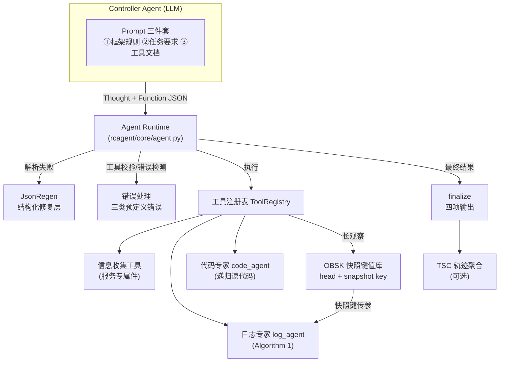

# 系统架构图

> 相关: [[与论文的对应关系]] | [[关键设计决策]] | [[Controller-Agent-循环]]

## 一句话架构

**一个 controller LLM 在"思考-行动-观察"循环中自主调用一组工具(含两个 LLM 专家),所有结构化输出经过 JsonRegen 修复,长观察经过 OBSK 压缩,错误行为被检测并反馈,最终以 finalize 工具输出四项 RCA 结果;多条轨迹可经 TSC 聚合成更稳健的答案。**

## 总体架构




## 整体决策循环(真实状态机,论文图2)

**先澄清**:循环的直观图是直线,但**真实控制流是以 LLM 生成为中心的辐射结构**——
几乎每个环节失败都回退到"LLM 生成"(下一轮,带错误反馈),不是线性前进。
对应代码 `agent.py:_loop` + `_handle_step` 的 11 个转移点。

```mermaid
stateDiagram-v2
    [*] --> LLM_GEN: 任务输入
    LLM_GEN --> PARSE: 生成 Thought+JSON
    PARSE --> LLM_GEN: 解析失败(错误反馈)
    PARSE --> TOOL_CHK: 解析成功
    TOOL_CHK --> LLM_GEN: 工具不存在/参数错(错误反馈)
    TOOL_CHK --> ERR_DET: 校验通过
    ERR_DET --> LLM_GEN: 重复调用/trivial/过早finalize(错误反馈)
    ERR_DET --> FINALIZE: 是 finalize
    ERR_DET --> SNAP: 是工具调用
    SNAP --> TOOL_EXEC: 快照键→完整内容
    TOOL_EXEC --> LLM_GEN: 执行失败(错误反馈)
    TOOL_EXEC --> OBSERVE: 执行成功
    OBSERVE --> LLM_GEN: 观察(head+snapshot)注入,下一轮
    FINALIZE --> [*]: 四项校验通过 → 结果
    FINALIZE --> LLM_GEN: 缺字段(错误反馈)
    note right of LLM_GEN: 所有失败路径(红)都回退到这里;\n带错误反馈重新生成(循环不终止)
```



**回退路径汇总**(红边全部回到 LLM_GEN):

| 回退来源 | 触发 | 反馈内容 |
| --- | --- | --- |
| 解析失败 | JsonRegen 修复不了 | 输出非法 JSON,请重试 |
| 工具校验 | 工具不存在/参数错 | 工具/参数问题说明 |
| 错误检测 | 重复调用/trivial/过早 finalize | 错误 + 改进建议 |
| 工具执行失败 | ToolError | 工具错误信息 |
| finalize 缺字段 | 四项不齐 | 字段缺失说明 |
| 正常回退 | 工具执行成功 | 观察(head + snapshot) |

**与论文图2 的对应**:左半(Thought and Action → Parsed Action → Environment → Observation → Memory)即上图主回路;论文右侧的 key-value store(OBSK)、expert agent(专家工具)、error handling(错误反馈)全部落在对应的子图上。

## 分层职责

| 层 | 模块 | 职责 | 与论文对应 |
| --- | --- | --- | --- |
| 决策层 | Controller Agent | 每步生成 Thought + JSON 动作 | §III 引言 |
| 运行时层 | Agent Runtime | 解析、校验、错误检测、执行、注入反馈 | §III-C2 |
| 修复层 | JsonRegen | 保证所有 LLM 结构化输出可解析 | §III-C1 Algorithm 2 |
| 工具层 | ToolRegistry + 工具集 | 信息收集、分析、出口 | §III-B |
| 压缩层 | OBSK | 长观察 head + 快照 | §III-A |
| 专家层 | log_agent / code_agent | LLM 作为分析工具 | §III-B2 |
| 聚合层 | TSC / 文本聚合 | 多轨迹投票 | §III-D |
| 评估层 | eval 包 | 语义指标 + LLM 评估器 | §IV-C |
| 适配层 | env 包 | 目标服务数据源(插件) | §III-B1 |

## 一次典型运行的完整数据流

以 `demo_es_conn_timeout` 为例(真实模型运行,10 步):

```
1. 构造 JobDesc(job_id, anomaly, detect_time)
2. Agent Runtime 组装 system prompt(三件套) + user prompt(作业描述)
3. 循环(最多 15 步):
   a. LLM 生成 "Thought + Function JSON"
   b. JsonRegen 修复 → 解析出 {function, kwargs}
   c. 校验: 工具存在?参数合法?错误检测(重复调用/trivial/过早finalize)?
   d. 执行工具(参数中的快照键先经 OBSK 解析为完整内容)
   e. 返回观察 head(+快照键)注入消息历史
   f. 若调用 finalize → 校验四项 → 退出
4. 结果 {root_cause, solution, evidence, responsibility}
5. (可选) TSC: 从倒数第二步重放 K 条采样子轨迹 → LLM 聚合
```

## 关键设计点

1. **单一数据交换格式**:controller 的动作、expert 的返回、聚合的中间产物全部是 JSON,经 JsonRegen 统一修复(论文: "JSON is chosen as the data interchange format")。
2. **无 few-shot**:与原始 ReAct 不同,RCAgent 丢弃 few-shot 示例(上下文预算),greedy 解码的轨迹历史本身充当示范(论文: trajectory-level zero-shot)。
3. **专家即工具**:log_agent/code_agent 对 controller 而言只是两个工具,但内部是独立的 LLM 推理流程——分析工作从 controller 的上下文里被"外包"出去。
4. **观察分层**:controller 只看到 head(或快照键),完整内容按需由专家消费——这是论文处理超长上下文的核心手段。
5. **一切可复现**:每条轨迹 JSONL 落盘(含每步送入 LLM 的确切 prompt),TSC 可从主轨迹 records 精确重建消息历史。

## 模块文件索引

| 文件 | 内容 |
| --- | --- |
| `rcagent/core/agent.py` | RCAgent 主类: run / _loop / _handle_step / replay_messages / fork_sampler |
| `rcagent/core/tools.py` | ToolSpec / ToolResult / ToolRegistry / dedup_lines / finalize |
| `rcagent/core/obs.py` | SnapshotStore / build_observation_head |
| `rcagent/core/jsonregen.py` | Algorithm 2 全流程 |
| `rcagent/core/parser.py` | parse_action(use_regen 开关) |
| `rcagent/core/errors.py` | ErrorDetector 三类错误 |
| `rcagent/core/trajectory.py` | StepRecord / Trajectory(JSONL 落盘) |
| `rcagent/core/prompts.py` | 三件套组装 |
| `rcagent/llm/` | client / decode / embedding |
| `rcagent/experts/` | log_agent / code_agent / partition / knowledge |
| `rcagent/sc/` | tsc / aggregate |
| `rcagent/eval/` | metrics / judge / report |
| `rcagent/env/` | adapter / local(demo 环境) |
