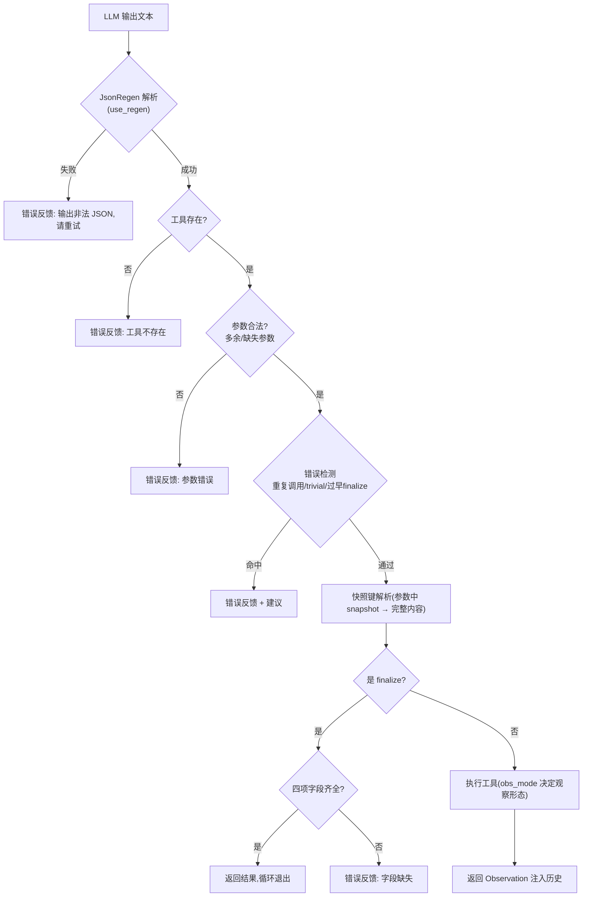

# Controller Agent 循环

> 相关: [[Prompt-三件套]] | [[工具注册与finalize]] | [[错误处理与解码策略]] | [[TSC与文本聚合]]
> 代码: `rcagent/core/agent.py`

## 是什么

RCAgent 的主干:一个 ReAct 风格的 **thought-action-observation 循环**。
每一步,controller LLM 输出"思考 + 一个 JSON 动作",运行时解析、校验、执行,
把观察注入消息历史,循环直到 controller 调用 `finalize` 退出。

与原始 ReAct 的三个关键差异(论文 §III):
1. **无 few-shot 示例**(上下文预算有限,trajectory-level zero-shot 工具调用);
2. **JSON 作为动作的唯一格式**;
3. 系统增强(OBSK/JsonRegen/错误处理/专家)全部挂在循环外,循环本身保持简单。

## 核心数据结构

### JobDesc(任务输入)

```python
@dataclass
class JobDesc:
    job_id: str        # 作业/实例 ID
    anomaly: str       # 异常描述(不可恢复失败/启动失败等)
    detect_time: str   # 检测时刻 —— 数据访问的截止约束
```

### 消息历史(messages)

```python
[
    {"role": "system",  "content": system_prompt},   # 三件套(见 [[Prompt-三件套]])
    {"role": "user",    "content": job_desc},         # 任务描述
    {"role": "assistant","content": "Thought: ...\nFunction: {...}"},  # 第 1 步
    {"role": "user",    "content": "Observation:\n..."},              # 观察/错误反馈
    ... 循环 ...
]
```

每步两条消息(assistant 动作 + user 反馈),**完整保留、不滚动截断**
——上下文压缩交给 [[OBSK-快照机制]] 而非消息截断。

## 主循环伪代码

```
run(job, decode_mode="greedy"):
    detector.reset()
    messages = 初始消息(system 三件套 + job 描述)
    for step in 1..max_steps(15):
        text = generate(llm, messages, mode=decode_mode)   # 见 [[错误处理与解码策略]]
        feedback = handle_step(text, job, record, traj)     # 单步处理
        if feedback is None:   # finalize 成功
            return result
        messages += [assistant(text), user(feedback)]
    return None   # 步数耗尽 → 失败(评估时填 "Unclear")
```

## 单步处理流程(_handle_step)



要点:
- 每一步的 `record`(StepRecord)写入 [[TSC与文本聚合|Trajectory]],包含原始输出、
  解析结果、错误、观察 head、**送入 LLM 的确切 prompt**;
- 无效动作(解析失败/工具不存在/参数错/错误检测命中)计入 `invalid_actions`
  —— 这是评估的 Invalid Rate 分子;
- finalize 的 kwargs 即四项结果,缺任一字段按无效动作处理。

## 重放与采样(为 TSC 预留)

```python
replay_messages(job, traj, n_kept):
    # 从主轨迹 records 重建 1..n_kept 步的消息序列
    # 依据: record.raw_action + record.observation_head 与真实消息逐字一致

fork_sampler(inherit_detector=True):
    # 创建采样子轨迹 agent: 共享 llm/store/registry
    # inherit_detector: 继承主轨迹的"已调查工具"状态,
    #   否则子轨迹直接 finalize 会被"过早 finalize"误拦截
```

这是 [[TSC与文本聚合]] 的基石:主轨迹跑完后,`replay_messages(job, traj, len-2)`
拿到倒数第二步之前的完整历史,子轨迹从那里继续采样。

## 变体系统(variant)

```python
VARIANTS = ("full", "react", "no_experts", "no_jsonregen", "no_obsk", "no_obs_head")
```

单点开关控制消融:
- `use_regen`: react / no_jsonregen 关闭 JsonRegen(走简化 JSON 解析)
- `obs_mode`: full | no_obsk(直接截断) | no_obs_head(只给快照键)
- detector.enabled: react 关闭错误处理
- include_experts: react / no_experts 不注册专家工具

见 [[消融变体与实验设计]]。

## 真实运行示例(DeepSeek,demo_es_conn_timeout,节选)

```
step 1: runtime_log   → Observation: 日志 head + [snapshot: 0242308476]
step 2: log_agent     → interpretation: ... evidence: <逐字日志行>
step 8: log_agent     → 错误反馈: 相同参数已在 step 2 调用过(重复调用被拦截)
step 10: finalize     → {root_cause, solution, evidence, responsibility}
```

## 关键代码索引

| 方法 | 职责 |
| --- | --- |
| `RCAgent.run` | 完整轨迹入口 |
| `RCAgent._loop` | 循环主体(生成→处理→注入) |
| `RCAgent._handle_step` | 单步: 解析/校验/检测/执行 |
| `RCAgent._extract_finalize` | 四项字段校验 |
| `RCAgent.replay_messages` | 消息重建(TSC 用) |
| `RCAgent.fork_sampler` | 子轨迹 agent 工厂(TSC 用) |
| `parse_action(text, use_regen)` | 动作解析(`core/parser.py`) |
