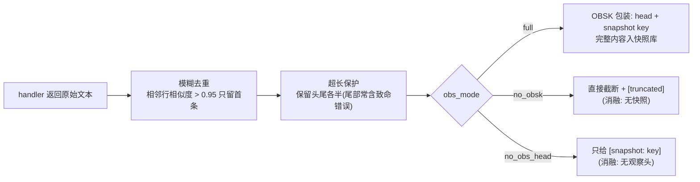

# 工具注册与 finalize

> 相关: [[Controller-Agent-循环]] | [[OBSK-快照机制]] | [[环境适配层与Demo数据]]
> 代码: `rcagent/core/tools.py`

## 是什么

工具层是 controller 与外部世界之间的唯一接口。设计遵循论文 §III-B1 的
"语义极简"原则:工具只接收简单参数(如 job_id),隐藏所有数据访问细节,
让 LLM 低门槛地产生有效动作。

## 工具契约

```python
@dataclass
class ToolSpec:
    name: str                      # 工具名(动作 JSON 的 function 字段)
    description: str               # 工具文档描述(自动进入 prompt)
    params: dict[str, str]         # 参数名 -> 参数说明(自动生成文档)
    handler: (kwargs, env) -> str  # 执行函数: kwargs -> 原始返回文本
    stateless: bool = True         # 无状态工具(重复调用检查对象)
    is_expert: bool = False        # 是否为 LLM 专家工具(trivial 输入检查对象)
    examples: str = ""             # 调用示例(帮助模型正确传参)
```

**handler 返回原始文本**,ToolRegistry.call 统一做后处理,工具实现不关心
OBSK/去重/截断——这些横切关注点集中在注册表一层。

## 统一的后处理管线(registry.call)



- **去重**(论文 §III-B1):防止重复数据膨胀上下文、诱发模型重复退化;
- **超长保护**:默认 200k 字符上限,超出保留头尾(错误块常在尾部,不能丢);
- obs_mode 三种形态对应 [[消融变体与实验设计]] 的 OBSK 消融。

## finalize — 出口工具

```python
make_finalize_spec(["root_cause", "solution", "evidence", "responsibility"])
```

- 参数即四项 RCA 结果(与标注格式对齐,论文 §IV-B1);
- `stateless=False`(不受重复调用检查);
- controller 自由决定何时调用(论文: "an exit point that allows the model to
  freely decide when to report findings");
- 调用后运行时校验四项字段齐全,缺项按无效动作处理(评估填 "Unclear")。

## 工具集清单(demo 环境)

| 工具 | 类型 | 参数 | 说明 |
| --- | --- | --- | --- |
| `runtime_log` | 信息收集 | job_id | taskmanager/jobmanager 运行时日志 |
| `platform_log` | 信息收集 | job_id | 平台层日志(调度/资源) |
| `infrastructure_log` | 信息收集 | job_id | 基础设施日志(网络/存储) |
| `advisor_db` | 信息收集 | job_id | advisor 服务历史记录 |
| `log_agent` | 专家 | snapshot | 长日志分析(Algorithm 1) |
| `code_agent` | 专家 | class_name | 递归代码分析(图4) |
| `finalize` | 出口 | 四项结果 | 报告并退出 |

## 为什么这样设计

1. **语义极简参数**降低动作无效率(论文 §III-B1: 防止在数据仓库中无意义探索),
   也让工具文档更短,节省上下文;
2. **横切逻辑集中**:OBSK/去重/截断在注册表统一处理,工具实现保持"纯数据",
   新增一个工具只需声明 spec + 实现 handler;
3. **注册式框架**:`register()` 即进入工具文档(prompt 动态生成),
   不可能出现"工具存在但文档缺失"或反之;
4. **服务专属件隔离**(PRD §2.11 耦合点 1):信息收集工具按目标服务重写,
   框架契约不变。
