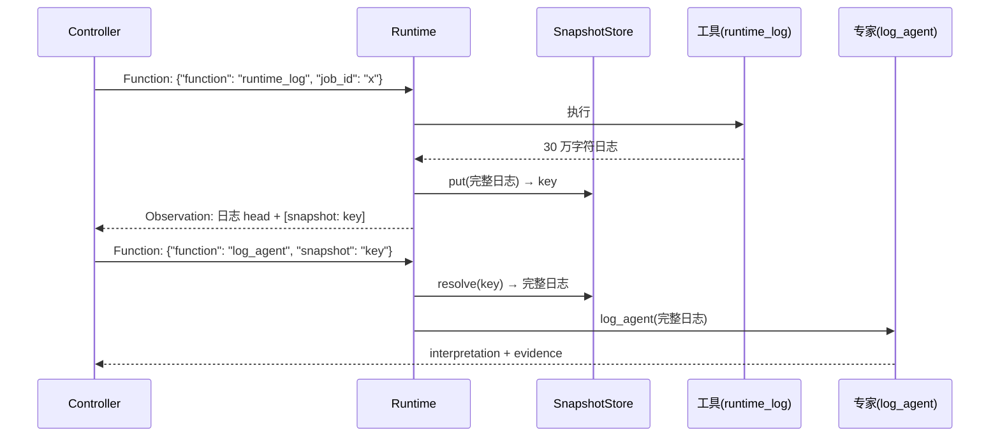

# OBSK 快照机制

> 相关: [[Controller-Agent-循环]] | [[工具注册与finalize]] | [[日志分析专家-Algorithm1]]
> 代码: `rcagent/core/obs.py`
> 论文: §III-A, 图2/图3

## 是什么

OBSK(OBservation Snapshot Key)解决 agent 在真实大数据环境下的**上下文长度**问题
(论文三大挑战之一):
- 工具返回的长观察(日志、表数据)**只向 controller 展示 head**(头部片段);
- 完整内容映射为**快照键**(10 位数字 hash)存入键值库;
- controller 需要处理完整内容时,**把快照键作为工具参数**传递,
  由运行时解析成完整内容交给工具(典型场景: 快照键传给 log_agent)。

## 三个核心概念

### 1. 快照键生成

```python
snapshot_key(content) -> str   # sha1(content) 前 12 位 hex → 10 位数字
```

确定性 hash(内容相同 → 键相同),对齐论文图3 的示例风格(`[snapshot: 2975241420]`)。

### 2. 观察头构造

```python
build_observation_head(content, head_chars) -> (head, key, truncated)
```

- 短内容(< head_chars,默认 4000)直接展示,无快照;
- 长内容截断并追加论文风格提示:
  ```
  ...53 lines omitted. [snapshot: 2975241420]
  ```

### 3. 快照键值库

```python
class SnapshotStore:
    put(content) -> key      # 入库并返回键
    get(key) -> content      # 取回完整内容
    resolve(value) -> str    # 参数解析: 是快照键就返回完整内容,否则原样
```

`resolve` 是核心接线点:运行时在**执行工具前**对 kwargs 的每个值调用
`store.resolve()`——快照键在到达工具 handler 前就被替换为完整内容,
工具实现无感知(它直接拿到完整日志)。

## 完整数据流



## 为什么有效(论文逻辑)

1. **信息分层**:controller 只需知道"有这段观察"(head 足以提示),完整内容
   由需要它的专家按需消费——prompt 长度从"30 万字符"降为"4000 字符 head";
2. **不丢信息**:与"直接截断"不同,快照键保证完整内容可恢复,
   专家工具不受 head 长度限制;
3. **模型可学习**:OBSK 规则写进框架规则 prompt(见 [[Prompt-三件套]]),
   真实运行中 DeepSeek 自主学会了"长日志 → 快照键 → 传给 log_agent",
   而不是复制日志内容;
4. **消融可测**:`obs_mode` 提供 `no_obsk`(直接截断)与 `no_obs_head`(只给快照)
   两个对照形态,对应论文消融实验(结论: 快照机制的价值超过观察 head 本身)。

## 真实运行证据

demo_es_conn_timeout 的真实轨迹中:
- step 1: `runtime_log` 返回 head + `[snapshot: 0242308476]`;
- step 2: controller 生成 `{"function": "log_agent", "snapshot": "0242308476"}`;
- 运行时 resolve 后 log_agent 收到完整 30 万字符日志并完成分析;
- 最终 finalize 的 evidence 里甚至引用了 platform 日志的快照键。

## 实现要点与边界

- 快照随轨迹生命周期存在,落盘供 TSC 重放复用(子轨迹共享 store);
- 键值库内存实现;超大规模场景可换外部 KV(接口已隔离);
- `resolve` 的误替换风险:参数恰好是 10 位数字且与某快照键相同——hash 冲突概率可忽略。
