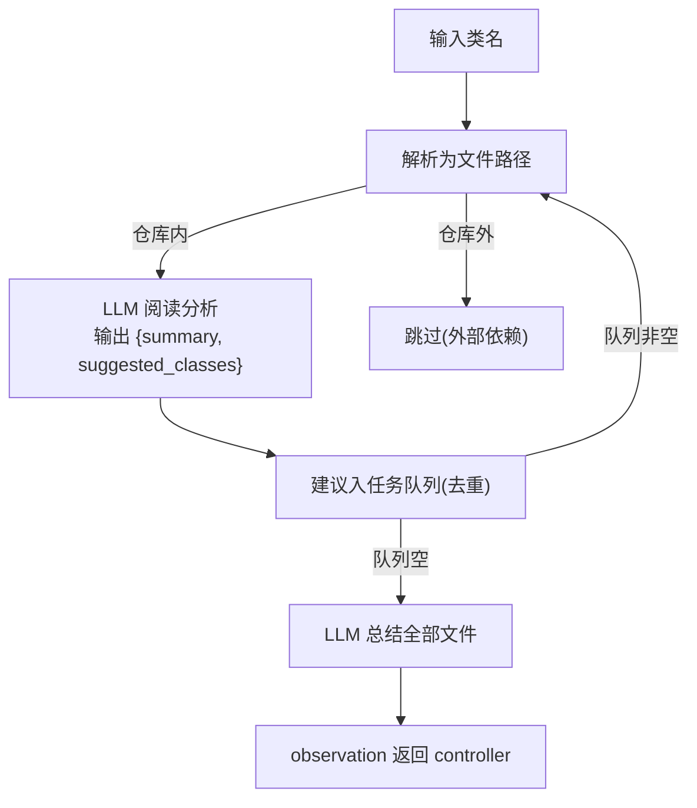

# 代码分析专家

> 相关: [[日志分析专家-Algorithm1]] | [[知识库与检索]] | [[环境适配层与Demo数据]]
> 代码: `rcagent/experts/code_agent.py`
> 论文: §III-B2, 图4

## 是什么

**递归代码分析工具**。controller 传入一个类名,专家自主沿着代码依赖链
读完相关文件,最后返回"这段诊断机制如何工作"的**知识结论**
(论文定位: *extend domain knowledge such as the working mechanism of
diagnose tools to the LLM control agent*)。

注意: 它**不是搜索工具**——输出是分析结论而非代码原文;
"读什么文件"也由专家自己决定(LLM 建议),不是 controller 指定。

## 递归流程(图4)



停止条件(论文): 无新推荐,或剩余推荐全部是外部依赖;另有
`max_files=20` 循环上限兜底。

## 通用化设计(仓库即插件)

用户确认的定位: **流程与具体仓库解耦,换仓库只换路径与配置**。

| 仓库特性 | 处理方式 |
| --- | --- |
| 语言 | 支持 11 种源码扩展名(java/py/go/cpp/ts/js/scala/kt/rs 等);prompt 措辞由配置注入(`language`) |
| 符号解析 | 简单名 / 完全限定名 / 模块路径 三种形态均可解析 |
| 外部依赖判定 | 仓库内无对应文件 = 外部依赖,跳过 |
| 代码频繁变动 | ① 内容实时读取,不缓存;② 文件索引每次调用重建(新增文件立即可见);③ git 按排障时间点分析作为预留方向 |
| 仓库描述 | `repo_name` / `language` 从 config 读取,适配新仓库只改配置 |

## 提示词设计

### 单文件分析
```
Analyze the following {lang} source file from the {repo_name} codebase...
Output JSON:
{"summary": "<这个文件做什么>", "suggested_classes": ["<值得继续分析的符号>"]}
```
- 建议的符号必须存在于本仓库(实现层校验,外部依赖直接跳过);
- 输出经 JsonRegen 修复。

### 总结
```
Below are analyses of the source files of a {repo_name} codebase...
Output JSON: {"summary": "<端到端的诊断机制解释>"}
```

## Demo 仓库(论文图4 结构复刻)

`data/code_repo/` 下 8 个 Java 类模拟 advisor 诊断服务:

```
JobConnectorSinkConnectionFailService  ← 入口(检查 SINK_CONN_ERROR 事件)
  ├── RuleDecisionBase (抽象基类) → RuleDecision (接口)
  ├── FlinkLifecycleMapper (数据访问层) → FlinkLifecycle (实体)
  ├── DecisionValueResult / DeploymentDto (DTO)
ExternalUtil (引用了仓库外的 commons-lang3,演示外部依赖判定)
```

真实运行(DeepSeek): 从入口类出发遍历 **7 个文件**,外部依赖正确跳过,
总结准确还原诊断机制(查询生命周期事件 → 命中返回决策值 1),成本 $0.0065。

## 边界与设计说明

- **循环上限**: `max_files=20` 防无限递归(LLM 可能反复建议同一批类);
- **任务队列去重**: 同一文件只分析一次(visited 集合);
- **解析失败容错**: 某文件分析输出不可解析 → 跳过该文件继续;
- **与 OBSK 的关系**: 代码文件通常不大,不经过 OBSK;
  它输出的分析文本直接作为 observation(与日志专家的"长内容"不同)。
