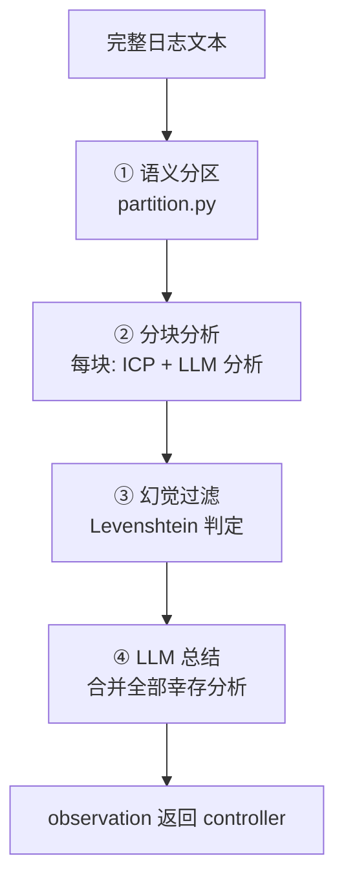

# 日志分析专家(Algorithm 1)

> 相关: [[OBSK-快照机制]] | [[知识库与检索]] | [[JsonRegen-结构化修复]]
> 代码: `rcagent/experts/log_agent.py` + `partition.py` + `knowledge.py`
> 论文: §III-B2, Algorithm 1

## 是什么

**长日志的 in-context RAG 分析工具**。controller 把完整日志(经 OBSK 快照键)
交给它,它返回 `{interpretation, evidence}`:
- interpretation: 日志揭示了什么故障;
- evidence: **逐字复制自日志原文**的支持证据(防幻觉)。

论文的背景观察: 长 prompt 会淹没"示例与目标数据"的分隔符,LLM 容易
分析 in-context 示例而不是目标日志;且偶尔幻觉。因此论文强制证据
必须逐字复制,无法与日志模糊匹配的分析结果**直接丢弃**。

## 四步流程



### ① 语义分区(partition.py)

把日志行分成**语义相关且内部连续**的 chunk(论文步骤 1-12):

1. 行切分 → 每行 embedding(真实 API 或 mock);
2. 构建加权图: 配对窗口 `j-i ∈ (0, 200]`,权重 `w = sim × exp(−d)`
   (语义相似 × 距离指数衰减; 负相似度截断为 0);
3. **Louvain 社区检测**(python-louvain);
4. **贪心去重叠**(关键步骤):聚类结果每个簇必须**在原文中连续**
   ——保留每个标签的最长连续段,其余段整体切换为相邻段的标签,迭代至稳定。

> 为什么必须连续: chunk 是"日志原文片段",LLM 分析的是连续上下文,
> 不连续的簇(标签交错)无法映射回原文。

### ② 分块分析(log_agent._analyze_chunk)

每块一轮 LLM 调用:
- **ICP**(in-context prompt):从 [[知识库与检索]] 检索相似示例-答案对,
  按相似度排序填充,直到不超过最大长度;
- prompt 结构: 示例 + 目标 chunk + 输出指令(零样本 CoT);
- 输出 JSON `{"interpretation": ..., "evidence": <逐字日志行>}`,
  经 [[JsonRegen-结构化修复|JsonRegen]] 解析;
- **并发**:chunk 间无依赖,ThreadPoolExecutor 4 路并行;
- **可疑度优先**:chunk 按 ERROR/Exception 密度降序,超上限时优先裁掉
  纯正常区域(工程优化: 错误块必进分析)。

### ③ 幻觉过滤(_evidence_ok)

```python
dist = Levenshtein.distance(evidence, chunk_text)
accept = dist < len(chunk_text) - len(evidence) * 0.9
```

含义: 证据 e 与 chunk p 的编辑距离必须小于阈值——e 的内容基本都能在
p 中逐字找到才接受。伪造/抄示例的证据距离大 → 丢弃。
(论文步骤 24-27, 本项目的工程化实现)

### ④ 总结(_summarize)

全部幸存分析合并 → LLM 输出最终 `{interpretation, evidence}`;
LLM 总结失败时退化为"证据最长的一条分析"(保证工具总有输出)。

## 缓存与性能

```python
self._cache: dict[md5(日志内容) -> 分析结果]
```

- 同一日志只分析一次(快照内容不变,结果可复用)——OBSK 的配套优化,
  真实评估中防止 controller 重复请求同一日志;
- 真实单 job 成本 $0.3~0.5(分块分析多次 LLM 调用),缓存+并发后
  4-job 评估约 15 分钟。

## 真实运行证据

demo_es_conn_timeout 的真实 log_agent 输出(节选):
```
interpretation: The Flink job is experiencing persistent instability...
evidence: 2024-01-01 09:02:52,752 ERROR org.apache.flink.connector.elasticsearch
          - SocketTimeoutException: Connect timed out [Elasticsearch:9200]
```
- evidence 与日志原文逐字一致(甚至保留了 JsonRegen 净化的 `<:` 痕迹);
- 控制器综合多个 log_agent 结果后 finalize,evidence 跨 runtime/platform/infra 三源。

## 与论文的参数对照

| 参数 | 论文 | 本项目(config) |
| --- | --- | --- |
| 配对窗口 | j−i ∈ (0, 200] | `log_agent.window` |
| ICP 示例数 | 未明确 | `log_agent.top_k` = 3 |
| ICP 最大长度 | N | `knowledge.max_chars` = 8000 |
| 证据过滤阈值 | len(p) − 0.9·len(e) | 硬编码(论文原式) |
