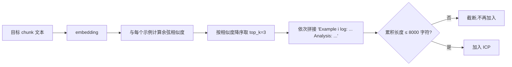

# 知识库与检索

> 相关: [[日志分析专家-Algorithm1]] | [[环境适配层与Demo数据]]
> 代码: `rcagent/experts/knowledge.py`
> 论文: §III-B2(Algorithm 1 步骤 15-21), §IV-B2

## 是什么

日志专家做 in-context RAG 的**示例库**:存储"日志片段 → 分析答案"的
示例-答案对,为分块分析提供检索上下文(对应论文的 Flink Advisor 历史子集)。

## 数据结构

```python
@dataclass
class KBExample:
    text: str    # 日志片段(示例输入)
    answer: str  # 对应分析(interpretation + evidence)

class KnowledgeBase:
    examples: list[KBExample]
    _vecs: [每个示例的 embedding]     # 构造时一次性计算
    search(chunk, top_k) -> [(text, answer)]   # 余弦相似度排序
    build_icp(chunk, top_k) -> str             # 组装 in-context prompt
```

## 检索与 ICP 填充(论文步骤 15-21)



要点:
- **按长度上限填充**: 超过 `max_chars` 的示例不再加入(控制 prompt 预算);
- **示例与目标分离**: 提示词明确要求证据只能从目标 chunk 复制
  (论文: 长 prompt 会淹没分隔符,模型易抄袭示例——这是幻觉过滤
  [[日志分析专家-Algorithm1|Algorithm 1 步骤 25]] 要防的核心场景之一)。

## 构建约束(论文 §IV-B2 的泄露红线)

> "We guarantee that no analysis rules for labeling are present in the log
> database by strict filtering."

**知识库不得包含标注规则**——否则评估时模型"抄答案",指标虚高。
项目实践:
- demo 知识库(`build_demo_kb`)由场景的错误模式 + 根因描述构成
  (诊断知识),ground_truth 是独立标注集;两者在结构上分离;
- 目标服务真实数据时,知识库应来自**历史工单/故障记录**等独立来源,
  并做规则文本过滤。

## demo 知识库内容(4 个场景)

| 场景 | 示例日志片段 | 答案(interpretation) |
| --- | --- | --- |
| es_conn_timeout | SocketTimeoutException 行 | ES 客户端压力/超时 |
| oss_lifecycle | RequestTimeTooSkewed 行 | bucket 生命周期规则缺失 |
| checkpoint_timeout | Checkpoint expired 行 | checkpoint 配置/状态后端问题 |
| task_evicted | Eviction notice 行 | 平台资源驱逐 |

## 为什么设计成"检索"而非"全量塞进 prompt"

- 日志域知识库会随服务增长(几百上千条),全量塞入不可行;
- embedding 检索天然支持"相似故障模式召回"——真实运行中,
  检索到的 ES 示例帮助专家识别 SocketTimeoutException 模式;
- 论文 §VI-A: embedding 模型能力对最终结果影响**边际**——
  所以用 API embedding 或轻量实现都可以,选型压力小。

## 扩展点(目标服务适配)

1. 从服务的历史工单/issue/诊断记录构造 `KBExample`;
2. 示例数量建议 20~50 条起步(覆盖高频故障模式);
3. 换 embedder 只需改 config(模型/端点),`KnowledgeBase` 构造时自动重算向量。
