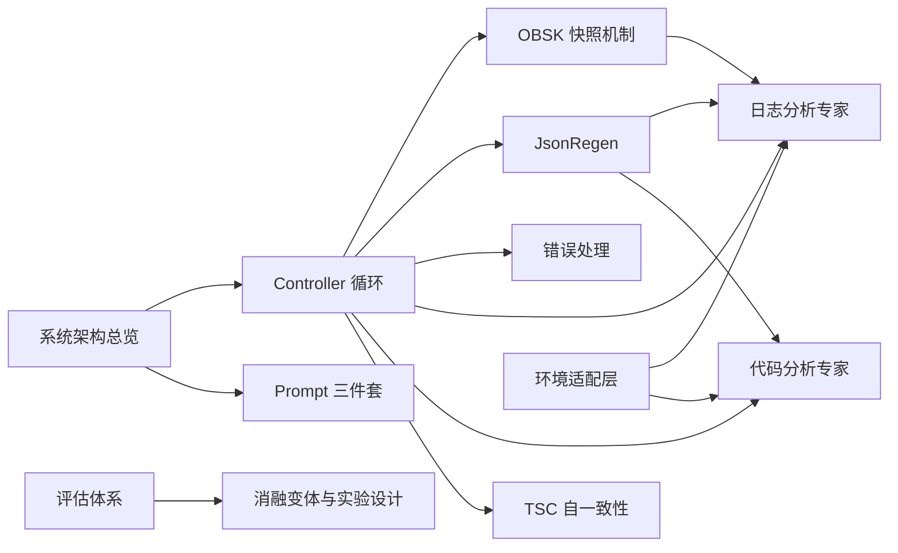

# RCAgent 复现项目 — 设计文档库

> 本库是 RCAgent(论文 [arXiv:2310.16340](https://arxiv.org/abs/2310.16340))复现项目的**实现架构讲解**。
> 用 Obsidian 打开本目录(`F:\RCA\obsidian`),在"图谱视图"中可以看到模块间的关联网络。

## 这是什么

RCAgent 是一个**工具增强的 LLM 自主智能体**,用于云服务异常根因分析(RCA):
给 LLM 一个"作业异常了"的任务,它自主决定查什么日志、调什么分析工具、何时下结论,
最终输出 `{root_cause, solution, evidence, responsibility}` 四项结果。
与论文一致,我们称决策循环中的 LLM 为 **controller agent**,被当作工具调用的 LLM 为 **expert agent**。

## 学习路径(按阅读顺序)



| 章节 | 文档 | 一句话内容 |
| --- | --- | --- |
| 总览 | [[系统架构图]] | 整体结构、模块清单、数据流 |
| 总览 | [[与论文的对应关系]] | 论文 8 大机制 ↔ 实现 ↔ 代码位置 |
| 总览 | [[关键设计决策]] | 已确认的技术选型与原因 |
| 核心循环 | [[Controller-Agent-循环]] | thought-action-observation 主循环 |
| 核心循环 | [[Prompt-三件套]] | 框架规则 / 任务要求 / 工具文档 |
| 核心循环 | [[工具注册与finalize]] | 工具契约、去重、出口设计 |
| 上下文 | [[OBSK-快照机制]] | 长观察压缩: head + 快照键 |
| 稳定化 | [[JsonRegen-结构化修复]] | 保证 LLM 输出可解析的修复层 |
| 稳定化 | [[错误处理与解码策略]] | 三类错误反馈 + 自适应惩罚 |
| 专家 | [[日志分析专家-Algorithm1]] | 长日志的分区 + RAG 分析 |
| 专家 | [[代码分析专家]] | 递归读代码,仓库即插件 |
| 专家 | [[知识库与检索]] | 示例-答案对与 ICP 填充 |
| 自一致性 | [[TSC与文本聚合]] | 轨迹级多路径投票 |
| 评估 | [[评估指标与评估器]] | 6 种语义指标 + LLM 评估 |
| 评估 | [[消融变体与实验设计]] | 对比/消融如何跑 |
| 环境 | [[环境适配层与Demo数据]] | 服务适配三件套 |
| 附录 | [[术语表]] | 术语速查 |
| 附录 | [[配置速查]] | config.yaml 全字段 |
| 附录 | [[复现进度清单]] | 完成 / 待办 |

## 代码结构速览

```
F:\RCA\
├── rcagent/
│   ├── core/          # 主循环、工具、OBSK、JsonRegen、错误处理、轨迹
│   ├── llm/           # LLM/Embedding API 封装、解码策略
│   ├── experts/       # 日志专家(Algorithm 1)、代码专家、知识库、语义分区
│   ├── sc/            # TSC 采样与文本聚合
│   ├── eval/          # 语义指标、LLM 评估器、报表
│   ├── env/           # 环境适配层(服务专属件)
│   └── main.py        # CLI
├── config/            # config.yaml + prompt 模板
├── data/              # demo 数据(demo_jobs + code_repo)
├── tests/             # 97 个单元测试
└── obsidian/          # ← 本库
```

## 相关文档

- 根目录 `PRD_RCAgent_复现开发文档.md` — 开发需求文档(功能需求、里程碑、验收标准)
- 根目录 `README.md` — 快速开始
- 论文原文提取: `rcagent_fulltext.txt`
